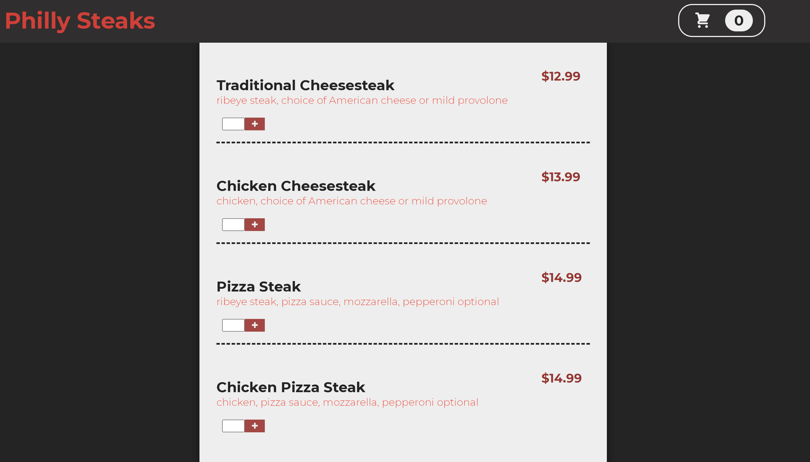
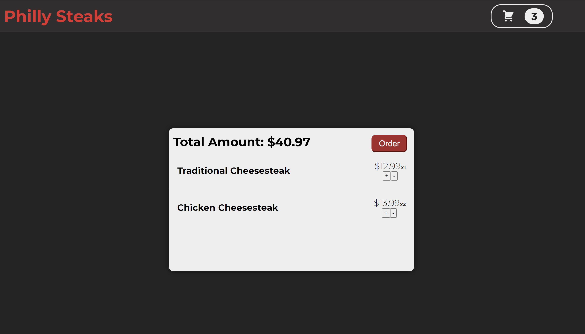
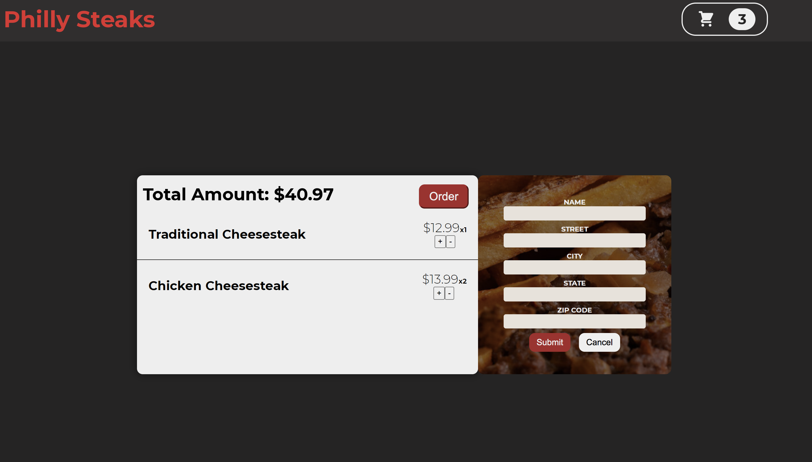

## About The App

This is a shopping cart to purchase philly cheesesteaks using locally stored data. Users can add a steak to the cart, update the cart and complete a mock order form.

## Screenshots

## Technologies

- React || React Router v6 || CSS modules

## Setup

- Download or clone the repository
- Run npm install
- Run npm start
